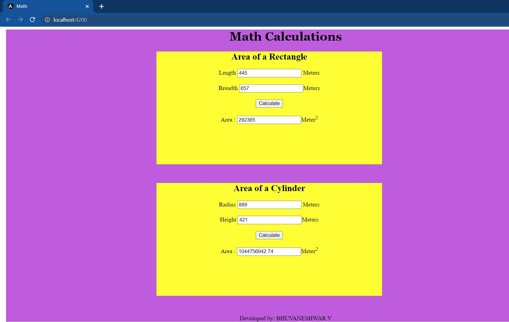

# AngularCalculation

# Web Page for Mathematical Calculations using Angular

## AIM:
To design a dynamic website to perform mathematical calculations using Angular Framework

## DESIGN STEPS:

### Step 1:

Requirement collection.

### Step 2:

Creating the layout using HTML and CSS in component.html file

### Step 3:

Write typescript to perform the calculations.

### Step 4:

Validate the layout in various browsers.

### Step 5:

Validate the HTML code.

### Step 6:

Publish the website in the given URL.

## PROGRAM :
app.component.html
~~~
<body>
  

      <h1>Math Calculations</h1>
      

          
          <Rectangle-Area></Rectangle-Area>
      

      

          <Cylinder-Area></Cylinder-Area>
      

      

          Developed by: BHUVANESHWAR V
      

  

</body>
~~~

app.component.ts
~~~
import { Component } from '@angular/core';

@Component({
  selector: 'app-root',
  templateUrl: './app.component.html',
  styleUrls: ['./app.component.css']
})
export class AppComponent {
  title = 'math';
}
~~~

app.component.css
~~~
.container{
    background-color: #343409;
    text-align: center;
    height: 720pxx;
}
.subcontainer{
    background-color: #FEFE33;
    width: 600px;
    height: 300px;
    text-align: center;
    margin-left: 400px;
    margin-bottom: 50px;
}
h1{
    font-family: Georgia, 'Times New Roman', Times, serif
    
}
~~~

app.module.ts
~~~
import { NgModule } from '@angular/core';
import { FormsModule, ReactiveFormsModule } from '@angular/forms'; 
import { BrowserModule } from '@angular/platform-browser';

import { AppRoutingModule } from './app-routing.module';
import { AppComponent } from './app.component';
import { RectangleComponent } from './rectangle/rectangle.component';
import { CylinderComponent } from './cylinder/cylinder.component';
import { CommonModule } from '@angular/common';

@NgModule({
  declarations: [
    AppComponent,
    RectangleComponent,
    CylinderComponent,
  ],
  imports: [
    BrowserModule,
    AppRoutingModule,
    CommonModule,
    FormsModule,
    ReactiveFormsModule
  ],
  providers: [],
  bootstrap: [AppComponent]
})
export class AppModule { }
~~~

rectangle.component.html
~~~

    <h2>Area of a Rectangle</h2>
    Length    <input  type="text" [(ngModel)]="length"> Meters  
    Breadth   <input [(ngModel)]="breadth"type ="text">Meters  
    <input type="button" (click)="onCalculate()" value="Calculate Area">  
    Area is <input [value]="area" type="text" >Meter2

~~~

rectangle.component.ts
~~~
import { Component } from "@angular/core";

@Component({
    selector:'Rectangle-Area',
    templateUrl:'./rectangle.component.html'

})
export class RectangleComponent{
    length:number
    breadth:number
    area:number
    constructor(){
        this.length = 0
        this.breadth = 0
        this.area = this.length*this.breadth;

    }
    onCalculate(){
        this.area = this.length*this.breadth;
    }
}
~~~

cylinder.component.html
~~~

    <h2>Area of a Cylinder</h2>
    Radius   <input  type="text" [(ngModel)]="radius"> Meters  
    Height   <input [(ngModel)]="height"type ="text">Meters  
    <input type="button" (click)="onCycCalculate()" value="Calculate Area">  
    Area is <input [value]="area" type="text" >Meter2

~~~

cylinder.component.ts
~~~
import { Component } from "@angular/core";
import { RadioControlValueAccessor } from "@angular/forms";

@Component({
    selector:'Cylinder-Area',
    templateUrl:'./cylinder.component.html'

})
export class CylinderComponent{
    radius:number
    height:number
    area:number
    
    constructor(){
        this.radius = 0
        this.height = 0
        this.area = 2*22/7*this.radius*(this.radius+this.height)

    }
    onCycCalculate(){
        this.area = this.area = 3.14*this.radius*this.radius*this.height
    }
}
~~~

## OUTPUT:

## Result:
Thus the above program to perform mathematical calculations using Angular framework is created successfully.
